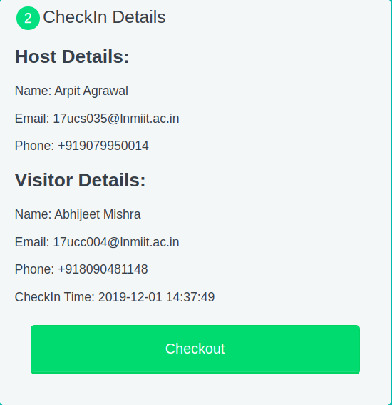

# Entry Management System

Given the visitors that we have in office and outside, there is a need to for an entry management
software.

## Project Configuration
```
1. Clone the repository:
    git clone https://github.com/arpit9667/entry_management

2. Install the required modules
    npm install

3. Create an account at Twilio(https://www.twilio.com) to get a valid mobile number and authentication token to send SMS.

    Update the /config/dev.env configuration file
        "MONGODB_URL"
        "EMAIL_SERVICE"
        "USER_NAME"
        "USER_PASSWORD"
        "SMS_SID"
        "SMS_TOKEN"
        "SMS_PHONE"
```

```
# Script to run the server
npm run start
```

### Tech Stack

1. JavaScript
2. HTML
3. CSS
4. NodeJS
5. ExpressJS
6. MongoDB
7. Twilio-API to send SMS

## Folder Structure
    --root
        |--config
            |--dev.env
        |--frontend
            |--404.html
            |--checkin.html
            |--display.html
            |--styles.css
            |--scripts.js
        |--utils
            |--connect.js
            |--mail.js
            |--sms.js
            |--router.js
            |--model.js
        |--app.js
        |--package.json
        |--README.md

## Approach
Whenever a user checks in, he/she needs to fill a checkin form:


After submitting the form, POST request to the route /checkin is sent with request-body as formData, the formData is then saved into a MongoDB Database along with the timestamp when the form is submitted which implies the checkin time for the visitor. While storing the data to MongoDB, the value of checkout field is NULL. Also, an email and a sms is also sent to the host containing the visitor's details. Twilio api and nodemailer are used for sending the sms and email notification respectively.

When a user wants to checkout, application will have a button for getting the current sessions. Clicking this button will send a GET request to the /displayCurrent route. From the fetched sessions, the user can choose his/her session to checkout. User has to click the Checkout button which will send a POST request to the /checkout route with request-body containing the unique id for the session(he/she wants to checkout). The checkout field for the session will be modified to the timestamp when the request is sent. Also, an email and sms will be sent to the visitor containing the deatils about the recent visit.

 

## Sample Notifications


## Author

* **Arpit Agrawal**  - [Github](https://github.com/arpit9667)
* **arpitagrawal312@gmail.com** 
