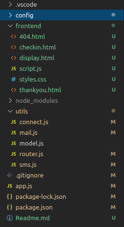
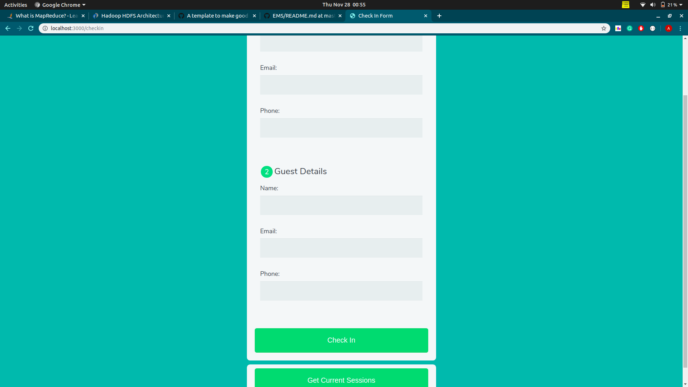

# Entry Management System

Given the visitors that we have in office and outside, there is a need to for an entry management
software.

## Getting Started
```
1. Clone the repository:
    git clone https://github.com/arpit9667/entry_management

2. Install Dependencies
    npm install
```
### Prerequisites

Create an account at Twilio(https://www.twilio.com) to get a valid mobile number and authentication token to send SMS.

```
Update the /config/dev.env configuration file
    "MONGODB_URL"
    "EMAIL_SERVICE"
    "USER_NAME"
    "USER_PASSWORD"
    "SMS_SID"
    "SMS_TOKEN"
    "SMS_PHONE"
```

```
# Script to run the server
npm run start
```

### Tech Stack

1. NodeJS
2. ExpressJS
3. MongoDB
4. Twilio-API to send SMS

## Folder Structure


## UI


## Working
1. '/checkin': Homepage(Image attached above).
2. Homepage will contain 'checkin' form  and 'Get Current Session' button that will fetch the current sessions available.
3. After submitting the checkin form, the host will recieve an email and sms containing the visitor details.
4. When a person wants to checkout, he/she can click on the 'Get Current Session' and can checkout his/her session. He/She will get an email and sms containing the information about the recent visit.


## Authors

* **Arpit Agrawal**  - [Github](https://github.com/arpit9667)
* **arpitagrawal312@gmail.com** * 
